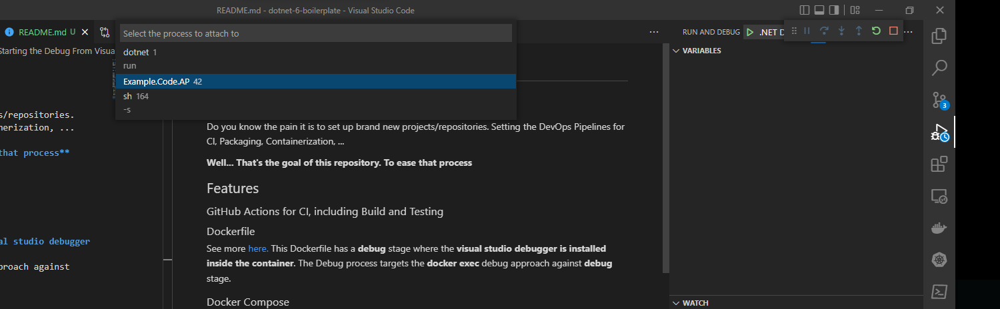

# .Net Boilerplate

## What is this repository used for?
Do you know the pain it is to set up brand new projects/repositories.
Setting the DevOps Pipelines for CI, Packaging, Containerization, ...

**Well... That's the goal of this repository. To ease that process** 

## Features

### GitHub Actions for CI, including Build and Testing
### Dockerfile
See more [here.](/src/Example.Code.API/Dockerfile)
This Dockerfile has a **debug** stage where the **visual studio debugger is installed inside the container**.
The Debug process targets the **docker exec** debug approach against **debug** stage. 
### Docker Compose
See more [here.](/src/docker-compose.yaml)
### VSCode Setup for docker compose based debugging
With this approach you won't even need a .NET SDK on your host
```bash
 # at /src/ run the following Commands
 docker-compose up -d --build
 # if you have multiple services inside the docker-compose.yaml you can opt-in by running the command below
 docker-compose up <service_name> up -d --build 
```
#### Starting the Debug From Visual Studio Code
